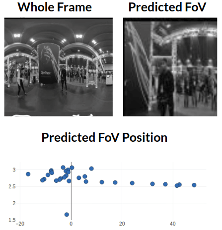
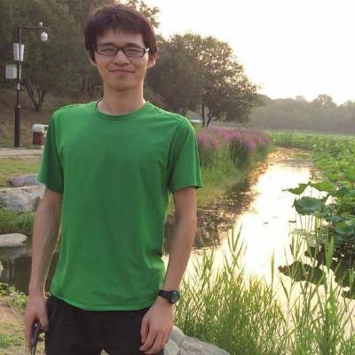

# DHP

This repository provides [**database**](#download-and-setup-pvs-hm-database), [**code**](#setup-an-environment-to-run-our-code) and [**results visualization**](#results-visualization) for reproducing all the reported results in the paper:

* [**Modeling Attention in Panoramic Video: A Deep Reinforcement Learning Approach.**](https://arxiv.org/abs/1710.10755)
[*Yuhang Song* &#8224;](https://yuhangsong.my.cam/),
[*Mai Xu* &#8224;&#8727;](http://45.77.201.133/html/Members/maixu.html),
[*Jianyi Wang*](http://45.77.201.133/html/Members/jianyiwang.html),
[*Minglang Qiao*](http://45.77.201.133/html/Members/minglangqiao.html).

Submitted to [TPAMI](https://www.computer.org/web/tpami) with **Minor Revision** at the **2nd** round of review.
By [MC2 Lab](http://45.77.201.133/) @ [Beihang University](http://ev.buaa.edu.cn/).

<p align="center"></p>

Specifically, this repository includes guidelines to:
* [Download the PVS-HMEM database](#download-PVS-HMEM-database).
* [Setup a environment to run our code.](#setup-an-environment-to-run-our-code)
* [Reproduce visualized results from the paper.](#results-visualization)

**Warning**: We have been working a updated version of DHP based on PyTorch with much more friendly setup procedures and strong GPU acceleration (The structure of the code is also cleaner).
This project is currently maintained, but will be depreciated in the future.

See [DHP-PyTorch](https://github.com/YuhangSong/DHP-pytorch) for the updated version. (Currently unavailable due to the copyright of our work)

## Download PVS-HMEM database

Our PVS-HMEM (Panoramic Video Sequences with Head Movement & Eye Movement database) database contains both **Head Movement** and **Eye Movement** data of **58** subjects on **76** panoramic videos.
* *Blue dots* represent the **Head Movement**.
* *Translucent blue circles* represent the **FoV**.
* *Red dots* represent the **Eye Movement**.

  |    |  
:-------------------------:|:-------------------------:|:-------------------------:
  |    |  
  |    |  

Download our PVS-HM database from [DropBox](https://www.dropbox.com/home/Yuhang%20Song/Dataset?preview=PVS-HM.tar.gz).
Please feel free to [contact us by clicking here](mailto:yuhangsong2017@gmail.com,maixu@buaa.edu.cn,IceClearWJY@buaa.edu.cn,MinglangQiao@buaa.edu.cn,huoliangyu@buaa.edu.cn) so that we can give you access permission to the file.
Then extract it with:
```
tar -xzvf PVS-HM.tar.gz
```
Note that it contains all MP4 files of our database, along with the HM & EM scanpath data ```FULLdata_per_video_frame.mat```.

For more details of the ```FULLdata_per_video_frame.mat``` file, refer to [here](#details-of-the-mat-data-file) (Note that you do not have to read the details of the mat file if you just want to run our code and reproduce the numbers).
For the EM data, please refer to [this](https://github.com/MinglangQiao/EM_Database/blob/master/README.md).

## Setup an environment to run our code

The code is based on [the A3C implementation](https://github.com/openai/universe-starter-agent) by OpenAI, we thank a lot for their contribution to the community.

If you are not familiar with things in this section, refer to [my personal basic setup](https://github.com/YuhangSong/Cool-Ubuntu-For-DL) for some guidelines or simply google it.

Install [Anaconda](https://www.anaconda.com/) according to the guidelines on their [official site](https://www.anaconda.com/download/), then install other requirements with command lines:
```
sudo apt-get install tmux

source ~/.bashrc

# create env
conda create -n dhp_env python=2.7

# active env
source activate dhp_env

# install packages
pip install gym tensorflow universe

# clone project
git clone https://github.com/YuhangSong/DHP-TensorFlow.git

# make remap excuatble
cd DHP-TensorFlow
chmod +x ./remap
# you may run ./remap here to make sure the remap is excuatble
```

## Run our code

Please make sure you have:
* More than 64 GB of RAM.
* More then 600 GB space on the disk you store PVS-HM database.

#### Offline-DHP.

This section clarifies procedures to train and test offline-DHP.

##### Prepare

Set the ```database_path``` in ```config.py``` to your database folder.

Generate YUV files. Set ```mode = 'data_processor'``` and ```data_processor_id = 'mp4_to_yuv'``` in ```config.py``` and run:
```bash
source ~/.bashrc
source activate dhp_env
python train.py
```
The converted YUV files will take about 600 Gb.
The reason we have to use YUV files is that, the remap function that get FoV from a 360 image is a binary file that takes YUV and output YUV.
We have developed a Python version of remap, but it turns out to be even slower than just reading and writing YUV files into the disk (for more then 5 times).
We are trying to see if remap is important to produce our results.
If not, we are going to depreciate remap in the Pytorch version of DHP.

Note that ```train.py``` is a script that starts multiple process managed by tmux.
Thus, after running ```train.py```, you can use ```tmux attach=session -t a3c``` to see how each process goes.
More about tmux can be found [here](https://github.com/tmux/tmux).

Generate groundtruth heatmaps. Set ```mode = 'data_processor'``` and ```data_processor_id = 'generate_groundtruth_heatmaps'``` in ```config.py``` and run:
```bash
source ~/.bashrc
source activate dhp_env
python train.py
```

##### Train

Set ```mode = 'off_line'```, ```procedure = 'train'``` and ```if_log_results = False``` in ```config.py```, run following:
```bash
source ~/.bashrc
source activate dhp_env
python train.py
```
During the first few episode, you may find the CPU usage is extremely low, this is due to the sub-process is competing on remap function, which exchange data with disk.
Later on, the CPU usage will increase.

<p align="center"></p>

Note that we trained for ```number_trained_steps = 1.113 * (10^6)``` to produce our results in the paper, we later found that training too much (10 times as many as ```1.113 * (10^6)```) may make the agent converge to FCB.

##### Test

Note that the model is stored and restored automatically.
Thus, as long as you did not change the ```log_dir``` in ```config.py```, previous trained model will be restored.
Set ```mode = 'off_line'```, ```procedure = 'test'``` and ```if_log_results = True``` in ```config.py```, then run following:
```bash
source ~/.bashrc
source activate dhp_env
python train.py
```
The code will generate and store predicted_heatmaps, predicted_scanpath and CC value.

If you are seeing
```
Starting training at step=<your-previous-global-step>
```
then the model is restored successfully.
If you are seeing
```
Starting training at step=0
```
then you have not restored it successfully, refer to [a corresponding issue](###restore-model-failed)

For results under more evaluation protocol. You may want to generate and store groundtruth_scanpaths with ```mode = 'data_processor'``` and ```data_processor_id = 'generate_groundtruth_scanpaths'```.

##### Load our trained model

To load our trained model, download our model from [DropBox link](xx), extract it to the path ```../results/```, and set ```log_dir = "../results/reproduce_5"```.
As has been said, the model in the ```log_dir``` will be automatically loaded.

##### Visualize training from TensorBoard

The code log multiple curves to help analysis the training process, type:
```
tensorboard --logdir <PATH>
```
where ```<PATH>``` is the ```log_dir``` in ```config.py```.
<p align="center"></p>

## Some hints on using the code.

* ```mode = 'data_processor'``` is a efficient way to process data under our TMUX manager, the code is in ```env_li.py```.
* Some features we used in TensorFlow will be depreciated in a future version, we are using ```tf.__version__=1.6.0``` to run our code.
* Reinforcement Learning based methods are inherently stochastic, and we cannot guarantee producing exact the same numbers as those reported in our DHP paper. But if you do more runs, we are confident to say you can see consistent results.

##### Summary your results after testing

After you have tested the model (setting ```if_log_results=True```), you can run
```
python summary.py
```
to summary the results.
It will show results like:
```
WaitingForLove|cc|0.7042685046323598
SpaceWar|cc|0.5894272979827889
KingKong|cc|0.540897356844711
SpaceWar2|cc|0.6233880089121158
Guitar|cc|0.6216974696171442
BTSRun|cc|0.5312920575202599
CMLauncher2|cc|0.6347282964835593
Symphony|cc|0.669106020987788
RioOlympics|cc|0.7695397332776495
Dancing|cc|0.6590623821187533
StarryPolar|cc|0.6511584747528362
InsideCar|cc|0.7628155513781555
Sunset|cc|0.7349986526376743
Waterfall|cc|0.6883913118465134
BlueWorld|cc|0.7158131732815242
Avg|0.6597722861515888
```
which should be able to reproduce the numbers reported in the paper.
If you meet any problem reproduce the numbers, please do not hesitate to contact us, you feed back on the environment settings and parameter settings will be well appreciated, since we are trying to provide the community a solid proposal.

## Meet some issues?

Please don not hesitate to open an issue.
We do not encourage you to contact us directly, opening an issue would be the best way to raise up your questions.

Some known issues & fixations are:

#### Restore model failed.

Navigate to ```w-0``` in tmux to see if this worker is working properly, because this worker is responsible for restoring model from disk, while other worker just async with it.
Then check ```<log_dir>/train/checkpoint```, it should look like:
```
model_checkpoint_path: "model.ckpt-5362890"
all_model_checkpoint_paths: "model.ckpt-5359910"
all_model_checkpoint_paths: "model.ckpt-5360655"
all_model_checkpoint_paths: "model.ckpt-5361444"
all_model_checkpoint_paths: "model.ckpt-5362210"
all_model_checkpoint_paths: "model.ckpt-5362890"
```
the ```model_checkpoint_path``` points to the latest checkpoint, the ```all_model_checkpoint_paths``` points to all available checkpoints.
Please make what is listed here matches the files lies in ```<log_dir>/train/```.

Then you will see a likely reason for restore failure is that the recent ckpt file is not stored completely when you killed the program, but it has been listed as available and should-be-restored in the checkpoint file.
Thus, you can simply remove corresponding ckpt file, along with modifying codes in checkpoint file.

For example, in about case, change ```<log_dir>/train/checkpoint``` to:
```
model_checkpoint_path: "model.ckpt-5362210"
all_model_checkpoint_paths: "model.ckpt-5359910"
all_model_checkpoint_paths: "model.ckpt-5360655"
all_model_checkpoint_paths: "model.ckpt-5361444"
all_model_checkpoint_paths: "model.ckpt-5362210"
```
and delete ```<log_dir>/train/model.ckpt-5362890``` will remove the most recent ckpt at 5362890 and restore the ckpt at 5362210.

## Results Visualization

### Reward Function

We propose a reward function that can capture transition of the attention.

Our reward function            |  Baseline reward function       
:-------------------------:|:-------------------------:
  |  

Specifically, in above example, the woman and the man are passing the basketball between each other, and subjects' attention are switching between them while they passing the basketball.
Our reward function is able to capture these transitions of the attentions smoothly, while the baseline reward function makes the agent focus on the man all the time, even when the basketball is not in his hands.

## Details of the mat data file.

The mat file includes 76 cells, which contains The HM data of all videos. Each cell provides the longitude and latitude of HM for 58 subjects, in total of 116 columns. The longitude and latitude are arranged alternately. For example, the first and second column include the latitude and longitude of the first subject, respectively. Note that the sampling rate is twice the video frame rate. The HM data takes the front center as origin, and the upper left as positive direction. So the value of longitude range from -180 to 180, and the latitude range from -90 to 90.

## Authors

[Yuhang Song](https://yuhangsong.my.cam) | [Mai Xu](http://45.77.201.133/html/Members/maixu.html) | [Jianyi Wang](http://45.77.201.133/html/Members/jianyiwang.html) | [Minglang Qiao](http://45.77.201.133/html/Members/minglangqiao.html) | [Zulin Wang](http://www.ee.buaa.edu.cn/info/1040/1130.htm) 
:-------------------------:|:-------------------------:|:-------------------------:|:-------------------------:|:-------------------------:
  |    |    |  | 

## Special Thanks

We would like to give special thanks to following researchers, for their valuable discussion and contribution to this work.

[Ziyu Zhu](https://personalpage.my.cam) | [Haochen Wang](https://personalpage.my.cam) | [Chen Li](https://personalpage.my.cam) | [Lai Jiang](https://personalpage.my.cam)
:-------------------------:|:-------------------------:|:-------------------------:|:-------------------------:
  |    |   | 
